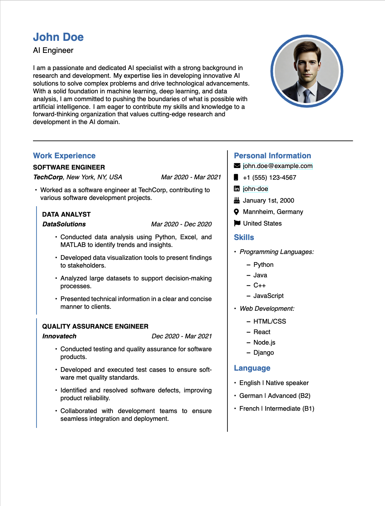
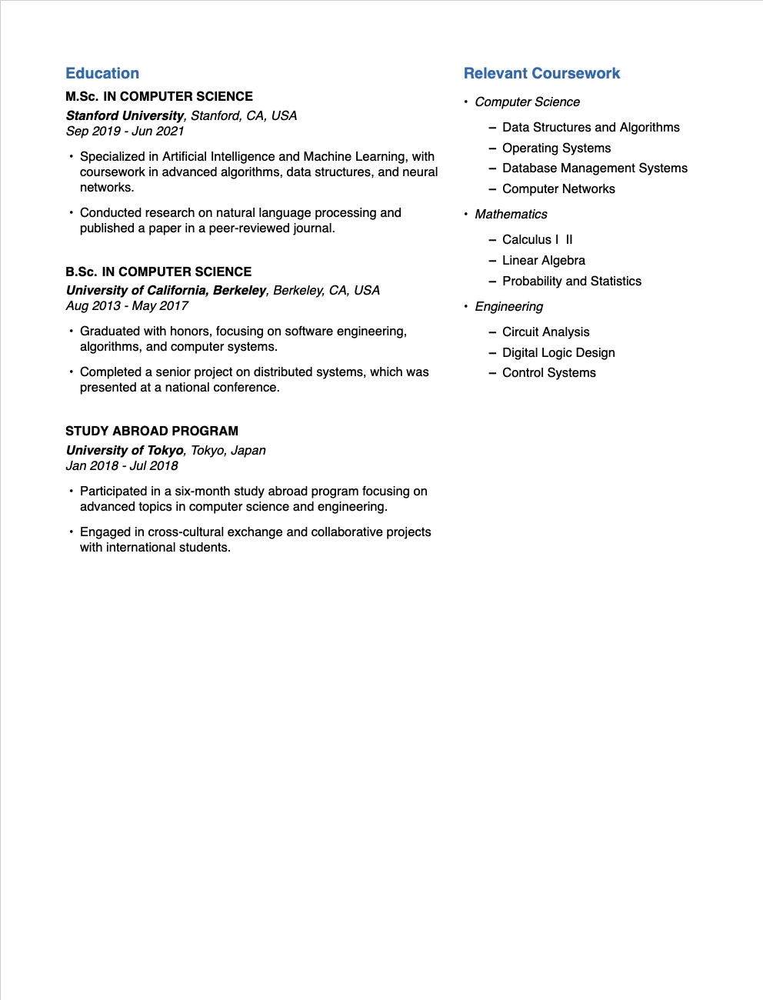

# My Awesome CV
Simple LaTex CV template.

## Usage
1. Clone the repository
2. Add the content to the sections.
3. Set up metadata (i.e. `accentcolor`, personal information)
4. Compile using `xelatex`
5. Rename `main.pdf`

## Example Images

|  |  |
